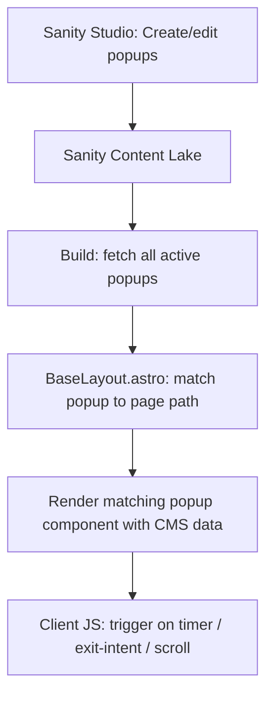

# CMS-Driven Popup System with Page Targeting

## Architecture



## 1. New Sanity Schema: `popup`

Create [sanity/schemas/popup.ts](sanity/schemas/popup.ts) as a document type with:

- **Internal label** (name) for Studio organization
- **Popup type**: `exit-intent`, `special-offer`, or `spinning-wheel`
- **Enabled** toggle
- **Priority** (number, higher wins when multiple popups match the same page)
- **Language** (`en` / `de`) so German pages can get German popups
- **Trigger settings**:
  - Delay in seconds (e.g., 5s for special offer, 15s for wheel)
  - Trigger mode: `timed`, `exit-intent`, or `scroll-percentage`
- **Targeting rules**:
  - Target mode: `all-pages`, `url-patterns`, or `specific-camps`
  - URL patterns: array of glob-like strings (e.g., `/surfcamp/bali/*`, `/de/surfcamp/bali/*`)
  - Camp references: array of references to `camp` documents (for camp-specific offers)
  - Exclude patterns: array of URL patterns to skip (e.g., `/studio`, `/legal`)
- **Scheduling**: optional start date and end date
- **Content fields** (conditional on popup type):
  - **Special Offer**: headline, body, ctaText, ctaHref, image, voucherCode, expiresAt (countdown)
  - **Exit Intent**: headline, body, ctaText, ctaHref, voucherCode
  - **Spinning Wheel**: headline, subheadline, segments array (label, color, prize code, probability)

Schema groups: General, Targeting, Content, Scheduling.

Preview: shows the internal name, popup type, and whether it's active.

## 2. Register Schema and Studio Structure

- Add `popup` to [sanity/schemas/index.ts](sanity/schemas/index.ts)
- Add a "Popups" section in the Studio sidebar in [sanity.config.ts](sanity.config.ts), placed near Redirects

## 3. Data Fetching

Add to [src/lib/queries.ts](src/lib/queries.ts):

```groq
*[_type == "popup" && enabled == true] {
  _id, popupType, priority, language,
  triggerMode, delaySeconds,
  targetMode, urlPatterns, excludePatterns,
  "targetCampSlugs": targetCamps[]->slug.current,
  startDate, endDate,
  headline, body, ctaText, ctaHref,
  image, voucherCode, expiresAt,
  subheadline, segments
}
```

Add a `getActivePopups()` function to [src/lib/sanity-data.ts](src/lib/sanity-data.ts) with a module-level cache (same pattern as the existing functions). Also add a `matchPopupForPath(path, lang)` helper that:
1. Filters by language
2. Filters by date (startDate/endDate vs now)
3. Filters by targeting rules (glob match on URL patterns, or check if path contains a camp slug from references)
4. Applies exclude patterns
5. Returns the highest-priority match

## 4. Update BaseLayout

In [src/layouts/BaseLayout.astro](src/layouts/BaseLayout.astro):

- Remove the old `showWheel` and `specialOffer` props
- Import `matchPopupForPath` and call it with `Astro.url.pathname` and the current locale
- Pass the matched popup data to the appropriate popup component
- Update the popup manager script to read trigger config (delay, mode) from a `data-` attribute on the script tag instead of hardcoded values

The old per-page `showWheel` and `specialOffer` props become unnecessary since targeting is now CMS-driven.

## 5. Update Popup Components

Minimal changes to the three existing popup components in `src/components/popups/`:

- They already accept props -- no structural changes needed
- The spinning wheel already accepts a `segments` prop
- Just ensure all text content comes from props with the current hardcoded values as fallbacks

## 6. Cleanup

Remove `showWheel` and `specialOffer` from `BaseLayout` Props interface and from any pages that pass them (scan for usage). The CMS is now the single source of truth for popup configuration.

## What this enables

- Create a "Bali Special Offer" popup in Sanity, set target to URL patterns `/surfcamp/bali/*` and `/de/surfcamp/bali/*`, and it only shows on Bali camp pages
- Schedule popups with start/end dates (e.g., holiday promotions)
- Set different popups for EN vs DE visitors
- Change copy, voucher codes, and targeting without code changes or rebuilds*

*Note: Since the site uses `output: "static"`, a Vercel rebuild is needed to pick up popup changes. This is standard for static sites with Sanity -- you'd typically set up a Sanity webhook to trigger Vercel deploys on publish.
