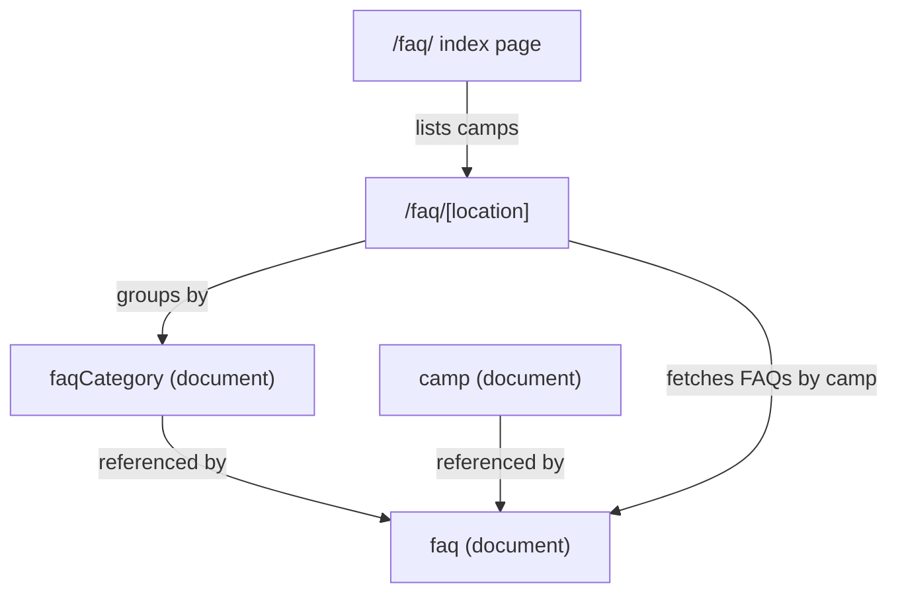

# FAQ Sanity Migration

## Current State

- FAQ pages (`/faq/` and `/faq/[location]`) use **hardcoded data** in the Astro templates
- A `faq` document type exists in Sanity but is **not used** by the frontend
- Categories are a fixed dropdown list in the schema (General, Booking, Surfing, etc.)
- The live site has 7 categories with 40+ FAQs per camp

## Target Structure



## Schema Changes

### 1. New `faqCategory` document type

Create [sanity/schemas/faqCategory.ts](sanity/schemas/faqCategory.ts):
- `name` (string, required) -- e.g. "Booking & Prices"
- `slug` (slug, from name)
- `order` (number) -- controls display order
- `language` (string, hidden) -- for i18n

### 2. Update existing `faq` document type

Update [sanity/schemas/faq.ts](sanity/schemas/faq.ts):
- Replace the fixed `category` string dropdown with a **reference** to `faqCategory`
- Keep `camps` (array of references to camp) -- determines which camp FAQ pages show this question
- Keep `countries` (array of references to country) -- for filtering
- Keep `language` field for i18n
- Add `order` (number) -- controls display order within a category

### 3. Register new schema + update i18n config

- Add `faqCategory` to [sanity/schemas/index.ts](sanity/schemas/index.ts)
- Add `faqCategory` to `I18N_SCHEMA_TYPES` in [sanity.config.ts](sanity.config.ts)
- Add `faqCategory` to the Studio sidebar under a logical group

## GROQ Queries

Add to [src/lib/queries.ts](src/lib/queries.ts):

- `FAQ_CATEGORIES` -- fetch all categories ordered by `order`
- `FAQS_BY_CAMP` -- fetch all FAQs referencing a given camp, with resolved category name/order, sorted by category order then FAQ order

Example:
```groq
*[_type == "faq" && $campRef in camps[]._ref && (language == $lang || (!defined(language) && $lang == "en"))] | order(category->order asc, order asc) {
  question, answer,
  "categoryName": category->name,
  "categoryOrder": category->order
}
```

## Data Fetching

Add to [src/lib/sanity-data.ts](src/lib/sanity-data.ts):
- `getFaqsBycamp(campSlug, lang)` -- fetches FAQs, groups them by category, returns `Record<string, {question, answer}[]>`
- Falls back to current hardcoded data if Sanity returns nothing

## Frontend Updates

### `/faq/index.astro`
- Switch from hardcoded `destinations` to `getDestinations()` from Sanity so new camps appear automatically

### `/faq/[location].astro`
- Replace the hardcoded `faqData` object with a call to `getFaqsByCamp()`
- Keep the existing `FAQSection` component (it already supports `grouped` prop)
- Keep the existing UI, JSON-LD schema, and camp link at the bottom

## Migration Script

Create a one-time Node.js script to:
1. Create `faqCategory` documents for: "Booking & Prices", "Rooms", "Surfing And Lessons", "How To Reach Us", "Sightseeing & Things Todo", "Food & Beverages", "Other"
2. Create individual `faq` documents from the hardcoded data, linked to the correct category and all camps (since current data is global)

## Notes

- The existing `faqSection` block (inline FAQs in page builders) remains unchanged -- it serves a different purpose (camp/country page-specific FAQs)
- Each FAQ document supports i18n via `@sanity/document-internationalization`, so German translations work via the existing "Translate with AI" workflow
- `faqCategory` also supports i18n so category names can be translated
