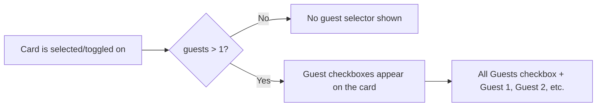

# Per-Guest Accommodation & Extras Assignment

## Current State

- [book.astro](src/pages/destinations/[slug]/book.astro): Single-select accommodation. Stores `accomId`, `accomName`, `accomPrice` in `bookingState`.
- [rooms.js](src/data/rooms.js): Each accommodation has a `capacity` field (1 for dorms, 2 for twin/double/suite).
- [extras.astro](src/pages/destinations/[slug]/extras.astro): Toggle extras on/off for the whole booking. Stores `extras` as `{ id: { name, price } }`.
- Guest count (`adults` + `children`) stored in `searchState` (sessionStorage).
- [checkout.astro](src/pages/destinations/[slug]/checkout.astro) and [confirmation.astro](src/pages/destinations/[slug]/confirmation.astro) calculate totals from flat values.

---

## Unified Pattern: Card-Level Guest Selector

Both accommodation cards and extras cards use the **same visual pattern** when there are multiple guests:




The shared `.guest-selector` element renders inside the card body when the card is active and `totalGuests > 1`. It contains:

- An **"All Guests"** convenience checkbox (checked by default)
- Individual **Guest 1**, **Guest 2**, ... checkboxes
- Checking "All Guests" checks all individuals; unchecking any individual unchecks "All Guests"

The key difference between accommodation and extras is the pricing logic.

---

## Part 1: Accommodation Cards (book.astro)

### Behavior

**When guests = 1**: Current single-select behavior. No guest selector shown.

**When guests > 1**:

1. Each available accommodation card shows guest checkboxes inline when clicked/expanded.
2. **Auto-move rule**: Each guest can only be assigned to ONE accommodation card at a time. Checking Guest 1 on "Twin Room" automatically unchecks Guest 1 from "Shared Dorm" (if previously assigned).
3. **Capacity-aware pricing**:
  - Twin Room (capacity 2) with Guest 1 + Guest 2 checked = **1 room, $65/night** (they share)
  - Shared Dorm (capacity 1) with Guest 1 + Guest 2 checked = **2 beds, $70/night** (each needs their own)
  - General formula: `unitsNeeded = Math.ceil(guestsOnCard / capacity)`, `cardTotal = unitsNeeded * pricePerNight`
4. Card price display updates dynamically: e.g., "2 beds -- $70/night" or "1 room (shared) -- $65/night"
5. Bottom bar shows combined total across all cards with assigned guests.
6. Continue is enabled when **every guest** is assigned to an accommodation.

### Data Structure (sessionStorage)

```javascript
// 2 guests in separate dorms
bookingState.roomBookings = [
  { accomId: 'shared-dorm', accomName: 'Shared Dorm', pricePerNight: 35,
    guests: ['Guest 1', 'Guest 2'], units: 2, totalPerNight: 70 },
]
bookingState.accomTotalPerNight = 70
bookingState.accomName = '2x Shared Dorm'
bookingState.accomPrice = 70

// 2 guests sharing 1 Twin Room
bookingState.roomBookings = [
  { accomId: 'twin-room', accomName: 'Twin Room', pricePerNight: 65,
    guests: ['Guest 1', 'Guest 2'], units: 1, totalPerNight: 65 },
]
bookingState.accomTotalPerNight = 65
bookingState.accomName = 'Twin Room'
bookingState.accomPrice = 65

// Mixed: Guest 1 in dorm, Guest 2 in private
bookingState.roomBookings = [
  { accomId: 'shared-dorm', accomName: 'Shared Dorm', pricePerNight: 35,
    guests: ['Guest 1'], units: 1, totalPerNight: 35 },
  { accomId: 'private-room', accomName: 'Private Double', pricePerNight: 95,
    guests: ['Guest 2'], units: 1, totalPerNight: 95 },
]
bookingState.accomTotalPerNight = 130
bookingState.accomName = 'Shared Dorm + Private Double'
bookingState.accomPrice = 130
```

### book.astro Implementation

- Add `data-accom-capacity={item.capacity}` to each card element.
- Pass accommodation array as JSON via `define:vars` for client JS access.
- Add `.guest-selector` HTML inside each `.accom-card-body` (hidden by default via CSS, shown via JS when card is active + guests > 1).
- New JS functions:
  - `toggleGuestOnCard(cardEl, guestIndex)`: check/uncheck a guest, enforce auto-move across cards.
  - `recalcRoomBookings()`: iterate all cards, build `roomBookings` array with capacity-aware unit calculation, update bottom bar and sessionStorage.
- The existing `selectAccom(el)` changes: for single guest it works as before; for multi-guest, clicking a card opens the guest selector on that card (and checks "All Guests" on first click as a convenience).

---

## Part 2: Extras Cards (extras.astro)

### Behavior

**When guests = 1**: Current toggle behavior. No guest selector shown.

**When guests > 1**: Each extra card gains a guest selector when toggled on:

1. Toggle an extra ON -- guest checkboxes appear on the card.
2. **"All Guests"** checked by default.
3. Unchecking a guest unchecks "All Guests". Re-checking "All Guests" re-checks all.
4. **Price = unitPrice x selectedGuestCount**. Display: "$45 x 2 guests = $90".
5. If all guests unchecked, the extra is toggled OFF entirely.
6. Bottom bar total sums all extras with their multiplied prices.

### Data Structure (sessionStorage)

```javascript
booking.extras = {
  'surf-lessons': {
    name: 'Surf Lessons',
    unitPrice: 45,
    guests: ['Guest 1', 'Guest 2'],
    totalPrice: 90,
  },
  'yoga': {
    name: 'Yoga Session',
    unitPrice: 15,
    guests: ['Guest 1'],
    totalPrice: 15,
  },
}
```

### extras.astro Implementation

- Read `totalGuests` from `searchState` on page load.
- Add `.guest-selector` HTML inside each `.extra-card-body` (hidden by default, shown when card is toggled on + guests > 1).
- Update `toggleExtra(el)`: when toggling on with multi-guest, show guest selector with "All Guests" checked.
- Add `toggleExtraGuest(extraId, guestIndex)` JS for individual guest checkbox changes.
- Update `updateExtrasUI()`: sum `totalPrice` (unitPrice x guests.length) for each extra.
- Update accommodation summary in subtitle/bottom bar to handle `roomBookings` (show "2x Shared Dorm -- $70/night").

---

## Part 3: Downstream Pages

### [checkout.astro](src/pages/destinations/[slug]/checkout.astro)

- **Accommodation breakdown**: iterate `roomBookings`. For each entry show: `accomName x units x nights = total`. E.g., "2x Shared Dorm x 5 nights = $350".
- **Extras breakdown**: for each extra, show `name (x N guests) = totalPrice`. E.g., "Surf Lessons (x2 guests) = $90".
- Grand total = sum of all room booking totals + sum of all extras totals.

### [confirmation.astro](src/pages/destinations/[slug]/confirmation.astro)

- Accommodation detail: list room bookings with guest names. E.g., "Shared Dorm (Guest 1), Twin Room (Guest 2)".
- Extras detail: show per-guest info. E.g., "Surf Lessons (2 guests), Yoga (Guest 1 only)".
- Breakdown and totals match checkout logic.

---

## Part 4: CSS (global.css)

### Shared Guest Selector (used by both accommodation and extras cards)

- `.guest-selector`: flex-wrap row of checkboxes inside the card body, subtle background/border to visually group
- `.guest-selector.hidden`: `display: none` (default state)
- `.guest-check`: inline-flex checkbox + label pair with custom styled checkbox
- `.guest-check-all`: slightly bolder/distinct style for the "All Guests" option
- Smooth max-height transition for slide-down reveal when selector appears
- Mobile: checkboxes wrap to new lines naturally via flex-wrap

### Accommodation Price Update

- `.accom-card-price-detail`: secondary line below the main price showing "2 beds -- $70/night" or "1 room (shared) -- $65/night"

### Extras Price Update

- `.extra-price-detail`: secondary line below the unit price showing "x2 guests = $90"

