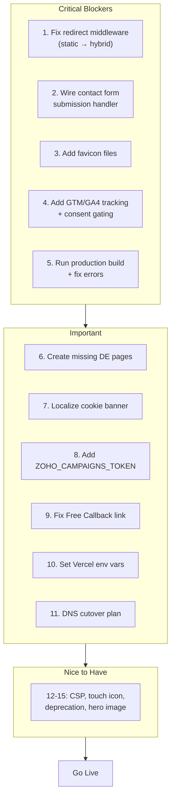

# Launch Readiness Audit — www.rapturecamps.com

## CRITICAL BLOCKERS (must fix before launch)

### 1. Redirects will NOT work in production

**The single biggest blocker.** The site uses `output: "static"` in [astro.config.mjs](astro.config.mjs), which means Astro middleware only runs at *build time*, not at *request time*. The 939 WordPress redirects and all 410 "Gone" responses imported into Sanity will silently fail in production — old WordPress URLs will return 404 instead of redirecting.

**Fix options (pick one):**
- **Option A (Recommended):** Switch to `output: "hybrid"` so pages are static by default but middleware runs on Vercel's serverless edge for every request. Add `export const prerender = true` to all existing pages to keep them static. Only the middleware and API routes run server-side.
- **Option B:** At build time, export all Sanity redirects to `vercel.json` redirects. Downside: requires rebuild whenever a redirect is added/changed in Sanity.

**Impact if skipped:** Every old WordPress URL (939+ paths) will 404. Google will see massive link equity loss. Users clicking old bookmarks/links will get dead pages.

---

### 2. Contact form does not submit

The contact form in [src/pages/contact.astro](src/pages/contact.astro) has no `action`, no `method`, and no JavaScript handler. Clicking "Send Message" does nothing.

**Fix:** Either:
- Wire it to the Zoho CRM/Campaigns API (similar to the popup submit at `api/popup-submit.ts`)
- Or use a form service (e.g., Formspree, Netlify Forms, or a custom API route that sends email)

**Impact if skipped:** Contact form is entirely broken. Visitors cannot reach the business through the website form.

---

### 3. No favicon

No favicon file exists in `public/`. The paths referenced in `BaseLayout.astro` (`/images/rapturecamps-logo.svg`) and `linkin-bio.astro` (`/favicon.svg`) point to non-existent files.

**Fix:** Add the Rapture Surfcamps logo as `public/images/rapturecamps-logo.svg` (and ideally `public/favicon.ico` for legacy browser support + `public/apple-touch-icon.png`).

**Impact if skipped:** Browser tabs show a broken/default icon. Looks unprofessional.

---

### 4. Google Analytics / GTM not implemented

No tracking code exists anywhere in the codebase. The GTM container `GTM-KQ66LK` is referenced in docs but never loaded. On launch day, all analytics data stops.

**Fix:** Add GTM snippet to [src/layouts/BaseLayout.astro](src/layouts/BaseLayout.astro), gated behind the cookie consent system (`window.rcConsent.analytics`). The `CookieBanner.astro` already has Analytics and Marketing consent categories — just need to wire them to GTM.

**Impact if skipped:** Zero visibility into traffic, conversions, and user behavior from day one. Historical GA continuity broken.

---

### 5. Production build not verified

Only `astro dev` has been run. A full `astro build` may surface errors that don't appear in dev mode (static path generation failures, missing data for certain routes, image optimization issues, etc.).

**Fix:** Run `npm run build` and resolve any errors or warnings. Then test with `npm run preview`.

**Impact if skipped:** Deployment could fail on Vercel, or pages could silently 404 in production.

---

## IMPORTANT (should fix before launch)

### 6. Missing German pages

These EN pages have no DE equivalent and will 404 for German users:

- `/de/contact` (Footer links to it as "Kontaktiere uns")
- `/de/jobs` (Footer links to it)
- `/de/surfcamp` (surfcamp index/listing page)
- `/de/thank-you` and `/de/survey-thank-you`

**Fix:** Create the DE versions, or at minimum add redirects from `/de/contact` to `/contact`, etc.

---

### 7. Cookie banner not localized

`CookieBanner.astro` has all English text ("We use cookies...", "Accept All", "Reject All", etc.) even on `/de/` pages. This is a GDPR compliance concern for German users.

**Fix:** Pass a `lang` prop and provide German translations.

---

### 8. ZOHO_CAMPAIGNS_TOKEN not in .env

The popup email capture system (`api/popup-submit.ts`) requires `ZOHO_CAMPAIGNS_TOKEN`, which is not set in `.env`. Popup email signups will fail silently.

**Fix:** Add the Zoho Campaigns API token to `.env` (and Vercel environment variables).

---

### 9. "Free Callback" is a placeholder

The Contact page has a "Free Callback" card linking to `href="#"`. It does nothing.

**Fix:** Either implement a Calendly/booking link, or remove the card before launch.

---

### 10. Vercel environment variables

All env vars (`PUBLIC_SITE_URL`, `PUBLIC_SANITY_PROJECT_ID`, `PUBLIC_SANITY_DATASET`, `SANITY_API_VERSION`, `SANITY_WRITE_TOKEN`, `ANTHROPIC_API_KEY`, `ZOHO_CAMPAIGNS_TOKEN`) must be configured in the Vercel dashboard for production. The code has fallbacks for some but not all.

---

### 11. DNS / Domain cutover plan

Switching `www.rapturecamps.com` from WordPress hosting to Vercel requires:
- Updating DNS records (A record or CNAME to Vercel)
- Adding the domain in Vercel dashboard
- SSL certificate provisioning (automatic on Vercel)
- Timing: do it during low-traffic hours
- Have a rollback plan (keep WordPress accessible for 24-48h)

---

## NICE TO HAVE (can address post-launch)

### 12. Content Security Policy
No CSP header is configured. Add one if loading third-party scripts (Zoho, Elfsight, GTM).

### 13. Apple Touch Icon / theme-color
No `apple-touch-icon.png` or `<meta name="theme-color">`. Minor polish.

### 14. Deprecation warning
`@sanity/image-url` default export is deprecated — switch to named import `createImageUrlBuilder`.

### 15. Contact page hero image
Currently uses a generic Unsplash stock photo. Consider replacing with a branded image.

---

## Pre-Launch Checklist Summary

