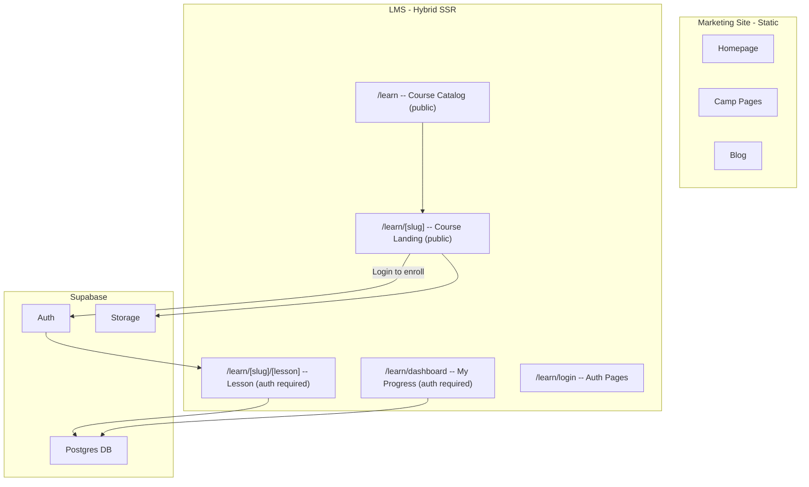

# LMS with Supabase -- Architecture Plan

## Why Supabase is the right call

- **Auth out of the box**: email/password, magic link, Google/social login -- no custom auth code
- **Postgres database**: real relational DB with Row Level Security (RLS) for per-user access control
- **Storage**: for course thumbnails, PDFs, attachments (videos via external embed using the `VideoBlock` component you already have)
- **Free tier**: generous for this scale (50k monthly active users, 500MB DB, 1GB storage)
- **Works with Astro**: official `@supabase/ssr` package for server-side auth in Astro hybrid mode

## Architecture Overview



## Database Schema

```
courses
  - id (uuid, PK)
  - title (text)
  - slug (text, unique)
  - description (text)
  - thumbnail_url (text)
  - is_published (boolean)
  - sort_order (int)
  - created_at (timestamptz)

modules
  - id (uuid, PK)
  - course_id (uuid, FK -> courses)
  - title (text)
  - sort_order (int)

lessons
  - id (uuid, PK)
  - module_id (uuid, FK -> modules)
  - title (text)
  - slug (text)
  - content_type ("video" | "text" | "quiz")
  - video_provider ("youtube" | "vimeo" | "wistia" | "file" | null)
  - video_src (text, null)
  - body_html (text, null)
  - duration_minutes (int, null)
  - sort_order (int)
  - is_free_preview (boolean)

enrollments
  - id (uuid, PK)
  - user_id (uuid, FK -> auth.users)
  - course_id (uuid, FK -> courses)
  - enrolled_at (timestamptz)

progress
  - id (uuid, PK)
  - user_id (uuid, FK -> auth.users)
  - lesson_id (uuid, FK -> lessons)
  - completed (boolean)
  - completed_at (timestamptz)
  - UNIQUE(user_id, lesson_id)
```

## What to do NOW (Phase 1 -- Foundation)

These steps take ~1-2 hours and don't affect the marketing site at all:

1. **Create Supabase project** at [supabase.com](https://supabase.com) -- pick EU region to match your audience
2. **Run the database migration** -- create the tables above with RLS policies
3. **Install dependencies**: `@supabase/supabase-js` and `@supabase/ssr`
4. **Add env vars**: `PUBLIC_SUPABASE_URL` and `PUBLIC_SUPABASE_ANON_KEY` to `.env`
5. **Create `src/lib/supabase.ts`** -- Supabase client helper (browser + server)
6. **Switch Astro to hybrid mode** in [astro.config.mjs](astro.config.mjs): change `output: "static"` to `output: "hybrid"` -- this keeps all existing pages static by default, but allows individual `/learn/*` pages to opt into SSR with `export const prerender = false`
7. **Create placeholder route** at `src/pages/learn/index.astro` with a "Coming Soon" page

This gives you the complete backend ready to go, without touching any marketing pages.

## What to do AFTER launch (Phase 2 -- LMS UI)

- `/learn` -- public course catalog grid (cards with thumbnail, title, lesson count)
- `/learn/[slug]` -- course landing page (syllabus, enroll button, free preview lessons)
- `/learn/login` -- login/signup page (Supabase Auth UI component)
- `/learn/[slug]/[lesson]` -- lesson viewer (uses your existing `VideoBlock` component for video lessons, rendered HTML for text lessons)
- `/learn/dashboard` -- user dashboard (enrolled courses, progress bars, continue where you left off)
- Middleware at `src/middleware.ts` to protect `/learn/*` routes (except catalog and login)

## Key Decisions

- **Video hosting**: Use external providers (YouTube/Vimeo/Wistia) via your existing `VideoBlock` component -- no need to store video files in Supabase Storage
- **No payment integration needed**: all courses are free (lead gen / guest value)
- **Hybrid mode is safe**: only `/learn/*` routes use SSR; everything else stays statically generated with zero performance impact
- **Course content management**: initially hardcoded or managed via Supabase dashboard; later can be moved to Storyblok if desired

## Recommendation

**Do Phase 1 now.** It takes minimal time, doesn't affect the marketing site, and means the LMS is ready to build immediately after launch. The `output: "hybrid"` switch is the only change that touches the existing config, and it has zero impact on static pages -- they continue to be pre-rendered at build time exactly as they are today.
