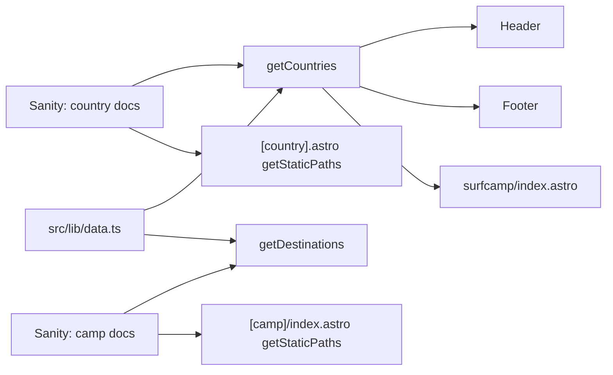

# Remove Morocco and Nicaragua Camps/Countries

## How it works today

Pages are driven by **Sanity CMS data** with **hardcoded fallbacks** in `src/lib/data.ts`. The flow:

Removing the Sanity documents stops page generation, but hardcoded fallbacks, navigation links, meta descriptions, and contact form options would still reference Morocco/Nicaragua.

## Two-layer approach

### Layer 1: Sanity Studio (manual, by you)

- **Unpublish or delete** the 3 camp documents: Banana Village, Playa Maderas, Maderas Surf Resort
- **Unpublish or delete** the 2 country documents: Morocco, Nicaragua
- **Delete FAQs** that are exclusively assigned to these camps (ones shared with other camps just need the Morocco/Nicaragua camp references removed)
- **Create 410 redirect entries** in the Redirects module for all old URLs:
  - `/surfcamp/morocco`
  - `/surfcamp/morocco/banana-village`
  - `/surfcamp/morocco/banana-village/surf`
  - `/surfcamp/morocco/banana-village/rooms`
  - `/surfcamp/morocco/banana-village/food`
  - `/surfcamp/nicaragua`
  - `/surfcamp/nicaragua/maderas`
  - `/surfcamp/nicaragua/maderas/surf`
  - `/surfcamp/nicaragua/maderas/rooms`
  - `/surfcamp/nicaragua/maderas/food`
  - `/surfcamp/nicaragua/maderas-surf-resort`
  - `/surfcamp/nicaragua/maderas-surf-resort/surf`
  - `/surfcamp/nicaragua/maderas-surf-resort/rooms`
  - `/surfcamp/nicaragua/maderas-surf-resort/food`
  - Plus `/de/` variants of all the above
  - The existing middleware in [src/middleware.ts](src/middleware.ts) already handles 410 responses

### Layer 2: Code changes (by me)

#### 1. Remove fallback data — [src/lib/data.ts](src/lib/data.ts)

- Remove the Banana Village, Playa Maderas, and Maderas Surf Resort entries from the `destinations` array
- Remove Morocco and Nicaragua from the `countries` array
- Remove Morocco and Nicaragua from the `navDestinations` array (if present)

#### 2. Remove hardcoded country content — [src/pages/surfcamp/\[country\].astro](src/pages/surfcamp/[country].astro)

- Remove the `morocco` and `nicaragua` blocks from the `countryContent` object (roughly lines 245-375)

#### 3. Update meta descriptions

- [src/layouts/BaseLayout.astro](src/layouts/BaseLayout.astro) — remove "Morocco" and "Nicaragua" from the default meta description
- [src/pages/surfcamp/index.astro](src/pages/surfcamp/index.astro) — same

#### 4. Update contact form — [src/pages/contact.astro](src/pages/contact.astro)

- Remove the 3 camp options: "Morocco - Banana Village", "Nicaragua - Playa Maderas", "Nicaragua - Maderas Surf Resort"

#### 5. Update jobs page — [src/pages/jobs.astro](src/pages/jobs.astro)

- Remove "Morocco" and "Nicaragua" from the copy

#### 6. Update linkin-bio — [src/pages/linkin-bio.astro](src/pages/linkin-bio.astro)

- Remove Morocco/Banana Village references from tagline and sample posts

#### 7. Update about section nav — [src/components/sections/AboutSection.astro](src/components/sections/AboutSection.astro)

- Remove the Morocco nav link

#### 8. Remove Nicaragua redirect — [astro.config.mjs](astro.config.mjs)

- Remove the `/surfcamp/nicaragua/playa-maderas/` redirect (page no longer exists)

#### 9. Regenerate sitemap

- The sitemap at `public/sitemap-0.xml` will be regenerated at build time automatically once the Sanity country docs are gone

#### 10. Migration scripts (optional cleanup)

- Scripts in `sanity/` (migrate-comparison, migrate-missing-images, etc.) reference these camps but are one-time migration tools — can leave as-is or clean up

## What we do NOT need to touch

- **Header, Footer, DestinationGrid**: These pull from `getCountries()` / `getDestinations()` which read Sanity first. Once Sanity docs are removed, they auto-exclude Morocco/Nicaragua. The fallback arrays (Layer 2, step 1) are backup only.
- **FAQ pages**: `getStaticPaths` in `faq/[location].astro` uses `getDestinations()`, so those FAQ pages won't generate. The middleware will serve 410 for old FAQ URLs if you add those redirects too.
- **Camp subpages** (surf, rooms, food): Same — driven by `getDestinations()`, won't generate.
