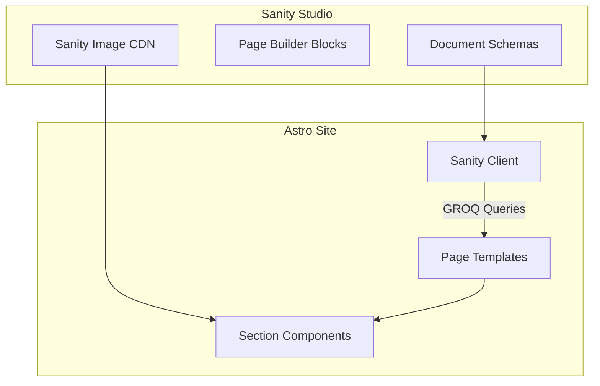

# Sanity CMS Migration Plan

## Architecture



**Studio recommendation**: Embed Sanity Studio inside the Astro project at `/studio`. This keeps everything in one repo, one deploy, and you can access it at `rapturecamps.com/studio`. No separate project to manage.

## Phase 1: Infrastructure Setup

Install Sanity dependencies and create the client configuration.

- Install `@sanity/client`, `@sanity/image-url`, `sanity`, `@sanity/vision` (studio query tool)
- Create `sanity.config.ts` at project root for Studio
- Create `src/lib/sanity.ts` — Sanity client + image URL builder + GROQ query helpers
- Add `/studio` route via Astro integration or static redirect
- Replace `src/lib/storyblok.ts` with Sanity client
- Add environment variables: `SANITY_PROJECT_ID`, `SANITY_DATASET` (default: "production"), `SANITY_API_VERSION`

## Phase 2: Sanity Schemas

Create document types and block types that map to the existing content structures. Key schemas:

**Document types** (top-level content):
- `camp` — Maps to current `Destination` interface in [src/lib/types.ts](src/lib/types.ts). Fields: name, country (reference), slug, images, location, tagline, rating, reviewCount, amenities, bookingUrl, coordinates, elfsightId, SEO fields
- `country` — Maps to the `countryContent` object in [src/pages/surfcamp/[country].astro](src/pages/surfcamp/[country].astro). Fields: name, slug, flag, description, heroImages, SEO fields, **pageBuilder** (array of blocks)
- `blogPost` — Maps to `BlogPost` interface. Fields: title, slug, excerpt, body (Portable Text), featuredImage, categories (references), tags, publishedAt, SEO fields
- `blogCategory` — name, slug, description
- `faq` — question, answer (Portable Text), camp/country references, category
- `siteSettings` — Global settings: stats, navigation, social links, default SEO

**Page builder block types** (reusable across pages):
- `contentBlock` — heading, body (Portable Text), image, reverse layout, background variant
- `imageGrid` — images array, variant (collage/two-up/three-up)
- `imageBreak` — image, caption, height
- `imageCarousel` — images with captions, aspect ratio, background
- `videoBlock` — type (youtube/vimeo/wistia/file), src, title, description, aspect
- `videoTestimonials` — array of testimonial objects
- `ctaSection` — heading, body, buttons
- `faqSection` — heading, FAQ references or inline Q&As
- `highlightsGrid` — array of highlight cards with icons
- `inclusionsGrid` — array of inclusion items
- `campComparison` — heading, subtitle, features, camp references
- `elfsightWidget` — widget type, app ID, heading

**Camp sub-page types** (structured content for surf/rooms/food):
- `surfPage` — linked to camp, contains surf spots, schedule, levels, pageBuilder blocks
- `roomsPage` — linked to camp, contains room types, pageBuilder blocks
- `foodPage` — linked to camp, contains meals, menus, dietary info, pageBuilder blocks

## Phase 3: Sanity Studio + Image Migration

- Configure Sanity Studio with desk structure (organized by content type)
- Set up image handling: replace Unsplash URLs with Sanity image assets
- Update [src/lib/image-utils.ts](src/lib/image-utils.ts) to support Sanity image URLs alongside Unsplash
- Create a `SanityImage` component that wraps `@sanity/image-url` with responsive `srcset` generation
- Upload current placeholder images to Sanity (can be automated with a script)

## Phase 4: Connect Pages to Sanity

Replace hardcoded content with GROQ queries, starting with the most impactful pages:

**4a. Camp + Country pages** (highest priority):
- [src/lib/data.ts](src/lib/data.ts) — Replace `destinations` array and `countries` array with Sanity queries (keep as a data layer so all existing pages work)
- [src/pages/surfcamp/[country].astro](src/pages/surfcamp/[country].astro) — Replace `countryContent` with Sanity country document + page builder rendering
- [src/pages/surfcamp/[country]/[camp]/index.astro](src/pages/surfcamp/[country]/[camp]/index.astro) — Replace hardcoded highlights, inclusions, testimonials with Sanity camp document + page builder
- Camp sub-pages (surf.astro, rooms.astro, food.astro) — Connect to Sanity sub-page documents

**4b. Page builder renderer:**
- Create `src/components/PageBuilder.astro` — Takes an array of Sanity blocks and renders the matching Astro component for each. This is the core of the flexible layout system.

```
PageBuilder receives blocks[] from Sanity
  → For each block, match block._type to component
  → contentBlock → <ContentBlock />
  → imageGrid → <ImageGrid />
  → videoBlock → <VideoBlock />
  → etc.
```

**4c. Homepage + static pages:**
- Homepage — Connect StatsSection and AboutSection to `siteSettings`
- About, Contact, FAQ pages — Connect to Sanity documents

## Phase 5: Blog Migration

- Create a WordPress import script (fetch from live WP REST API → create Sanity documents)
- Convert WordPress HTML content to Sanity Portable Text
- Migrate featured images to Sanity image assets
- Map WordPress categories to Sanity `blogCategory` documents
- Update [src/pages/blog/[slug].astro](src/pages/blog/[slug].astro) to query Sanity
- Update [src/pages/blog/index.astro](src/pages/blog/index.astro) and category pages
- Update [src/components/sections/BlogFeed.tsx](src/components/sections/BlogFeed.tsx)

## Deployment + Preview

- Configure Sanity webhook to trigger Vercel rebuild on content publish
- Set up Sanity preview mode for draft content viewing
- Remove Storyblok dependency (`@storyblok/astro`) from package.json

## Key Files Modified

| Current File | Change |
|---|---|
| `package.json` | Add Sanity deps, remove Storyblok |
| `src/lib/storyblok.ts` | Replace with `src/lib/sanity.ts` |
| `src/lib/data.ts` | Fetch from Sanity instead of hardcoded arrays |
| `src/lib/image-utils.ts` | Add Sanity image URL support |
| `src/lib/types.ts` | Update interfaces to match Sanity document shapes |
| `src/pages/surfcamp/[country].astro` | GROQ queries + page builder |
| `src/pages/surfcamp/[country]/[camp]/*.astro` | GROQ queries + page builder |
| `src/pages/blog/*.astro` | GROQ queries for blog content |
| All section components | Accept Sanity data props (mostly unchanged) |

## What Stays The Same

- All Astro section components (Hero, ContentBlock, ImageGrid, etc.) keep their current props/markup
- URL structure (`/surfcamp/bali/green-bowl/surf`) stays identical
- Tailwind styling untouched
- SEO setup (breadcrumbs, JSON-LD, OG tags) stays but sources data from Sanity
- Elfsight integration unchanged
- Popup system unchanged
