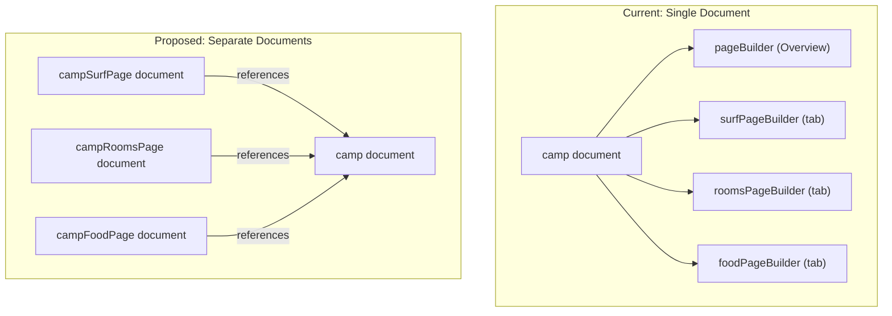

# Split Camp Sub-Pages Into Separate Sanity Documents

## Architecture Change

## New Sanity Schemas

### 1. `campSurfPage` schema ([sanity/schemas/campSurfPage.ts](sanity/schemas/campSurfPage.ts))

- `language` (string, hidden)
- `camp` (reference to `camp`, required) — the parent camp
- `heroTitle` (string) — override for surf hero headline
- `pageBuilder` (array) — same blocks currently in `surfPageBuilder`: surfIntro, surfForecast, surfSpots, surfLevels, surfSchedule, surfEquipment + universal blocks
- `seo` (seo type)

### 2. `campRoomsPage` schema ([sanity/schemas/campRoomsPage.ts](sanity/schemas/campRoomsPage.ts))

- Same structure: `camp` reference, `heroTitle`, `pageBuilder` with roomTypes, roomInclusions, roomFacilities + universal blocks, `seo`

### 3. `campFoodPage` schema ([sanity/schemas/campFoodPage.ts](sanity/schemas/campFoodPage.ts))

- Same structure: `camp` reference, `heroTitle`, `pageBuilder` with foodIntro, mealCards, menuTable, dietaryOptions + universal blocks, `seo`

## Clean Up Camp Schema

In [sanity/schemas/camp.ts](sanity/schemas/camp.ts):

- Remove `surfPageBuilder`, `roomsPageBuilder`, `foodPageBuilder` fields
- Remove `surfHeroTitle`, `roomsHeroTitle`, `foodHeroTitle` fields
- Remove the `surfPage`, `roomsPage`, `foodPage` groups
- Keep only `overview` and `seo` groups

## Update Studio Structure

In [sanity.config.ts](sanity.config.ts), update the structure builder so camps display as a nested hierarchy:

- Camps > [Camp Name] > Overview / Surf / Rooms / Food

This makes it intuitive — click a camp, see its sub-pages listed underneath.

## New GROQ Queries

In [src/lib/queries.ts](src/lib/queries.ts):

- Add `CAMP_SURF_PAGE` query: fetches `campSurfPage` by camp slug + language, dereferences the parent camp for shared data (name, country, heroImages, bookingUrl, etc.)
- Add `CAMP_ROOMS_PAGE` and `CAMP_FOOD_PAGE` similarly
- Simplify `CAMP_BY_SLUG` — remove surfPageBuilder/roomsPageBuilder/foodPageBuilder projections

## New Data Functions

In [src/lib/sanity-data.ts](src/lib/sanity-data.ts):

- Add `getCampSurfPage(campSlug, lang)`, `getCampRoomsPage(campSlug, lang)`, `getCampFoodPage(campSlug, lang)`
- Simplify `getCampBySlug` — no longer needs to attach sub-page builders

## Update Astro Pages

Update the 6 sub-page files to use the new fetchers:

- [src/pages/surfcamp/[country]/[camp]/surf.astro](src/pages/surfcamp/[country]/[camp]/surf.astro) — call `getCampSurfPage(camp)` instead of extracting from camp data
- [src/pages/surfcamp/[country]/[camp]/rooms.astro](src/pages/surfcamp/[country]/[camp]/rooms.astro)
- [src/pages/surfcamp/[country]/[camp]/food.astro](src/pages/surfcamp/[country]/[camp]/food.astro)
- Same for DE versions in `src/pages/de/surfcamp/...`

## Data Migration

Create a one-time migration script ([sanity/migrate-subpages.mjs](sanity/migrate-subpages.mjs)) that:

1. Fetches all existing camp documents
2. For each camp that has `surfPageBuilder` / `roomsPageBuilder` / `foodPageBuilder` content, creates the corresponding new sub-page documents
3. Copies the page builder arrays and hero titles to the new documents
4. Preserves `_key` values on blocks so references stay intact
5. Links translation metadata if German versions exist

## Register New Types

In [sanity/schemas/index.ts](sanity/schemas/index.ts), register the 3 new schema types and add them to the document internationalization plugin config.