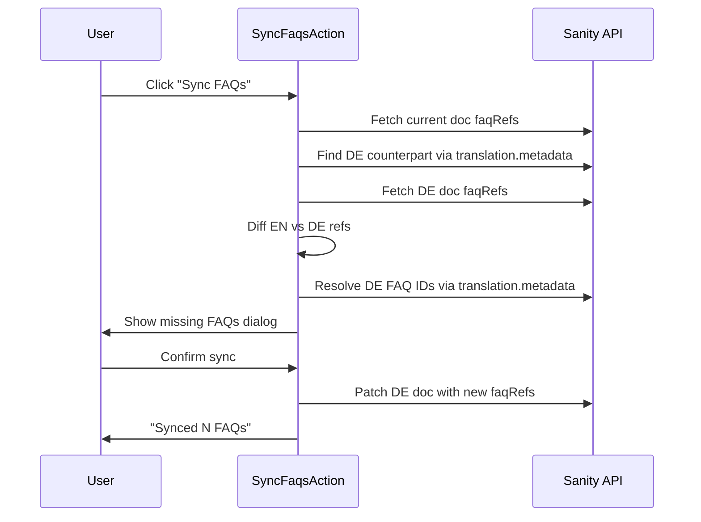

# Sync FAQs to Translations Action

## How it works

When editing an English page (camp, campSurfPage, etc.) that has `faqSection` blocks in its `pageBuilder`, a new "Sync FAQs" button appears in the document actions menu. Clicking it:

1. Scans the current document's `pageBuilder` for `faqSection` blocks and collects all `faqRefs`
2. Finds the German counterpart via `translation.metadata`
3. Compares FAQ refs between EN and DE versions
4. For each missing ref, looks up the German translated FAQ via `translation.metadata`
5. Shows a dialog listing which FAQs will be added (with question text preview)
6. On confirmation, patches the German document's `faqSection` blocks with the translated FAQ refs

## Key file

- **New file:** [sanity/actions/syncFaqsAction.tsx](sanity/actions/syncFaqsAction.tsx) — The document action component

## Implementation details

- Only shows on English documents (`language === "en"` or undefined) that have document types containing `pageBuilder` with `faqSection` blocks
- Uses `useClient` from Sanity to fetch and patch
- Handles the case where a German FAQ translation doesn't exist yet (warns the user: "Translate this FAQ first")
- Also handles removing FAQs that were removed from the English version (optional, shown as separate list)
- Registered in [sanity.config.ts](sanity.config.ts) alongside existing actions

## Scope

- Applies to document types: `camp`, `campSurfPage`, `campRoomsPage`, `campFoodPage`, `country`, `page`, `homepage`
- Only syncs `faqRefs` within `faqSection` blocks in `pageBuilder`
- Direction: English to German (could be extended to other languages later)

