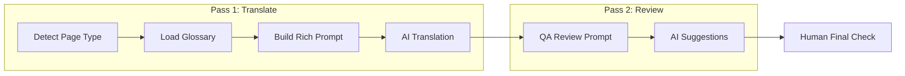

# Translation Workflow Implementation Plan

## Current State

The translation system lives in two files:
- [src/pages/api/translate.ts](src/pages/api/translate.ts) -- API endpoint that sends all translatable content to Claude/OpenAI in a single prompt
- [sanity/actions/translateAction.tsx](sanity/actions/translateAction.tsx) -- Sanity Studio action with provider choice, mode selection, and custom instructions textarea

Currently it does a **single API call** with a generic prompt ("rewrite in natural German") plus whatever custom instructions the editor types. This covers your step 3 loosely, but steps 1-2 and 4-7 are not addressed.

## Architecture Decision: Enriched Single Pass vs Multi-Pass

Running 7 separate API calls per document would be prohibitively expensive and slow across 300+ posts. Instead, the plan uses a **two-pass approach**:

- **Pass 1 (Translation):** A comprehensive prompt that embeds steps 1-6 (content analysis, glossary, translation, localization, conversion, consistency) into a single intelligent call, guided by a glossary document and page-type detection
- **Pass 2 (Review -- optional):** A separate "QA review" pass that checks the translated output against steps 4-7 (localization quality, CTA strength, SEO metadata, consistency)
- **Step 8 (Human):** A checklist document for manual final review

## Implementation Details

### 1. Create Translation Glossary File

Create `docs/translation-glossary-de.md` containing:

- **Brand terms** that must NOT be translated (Rapture, Rapturecamps, Green Bowl, Padang Padang, Coxos Surf Villa, etc.)
- **Established surf terms** to keep in English (Lineup, Surfspot, Surfcamp, Reef Break, Beach Break, etc.)
- **Terms to translate** with preferred German equivalents (e.g., "surf lesson" -> "Surfstunde", "booking" -> "Buchung")
- **CTA preferences** (e.g., "Book Now" -> "Jetzt buchen", "Learn More" -> "Mehr erfahren")
- **Words/phrases to avoid** (overly formal language, specific anglicisms)
- **Form of address:** du/ihr (informal), never Sie
- **German SEO keywords** per page type (e.g., "Surfcamp Portugal", "Surfen lernen Bali")
- **Tone guidelines:** casual, inspiring, adventurous, like a friend recommending a trip

### 2. Enhance the Translation Prompt with Page-Type Awareness

Modify `buildTranslationPrompt()` in [src/pages/api/translate.ts](src/pages/api/translate.ts) to:

- Accept `documentType` parameter (detected from Sanity `_type`: blogPost, camp, country, page, campSurfPage, etc.)
- Load and inject the glossary content into the prompt
- Add page-type-specific instructions:
  - **Landing pages / camp pages:** Focus on conversion, strong CTAs, benefit-driven headlines
  - **Blog posts:** Natural editorial tone, SEO keyword awareness, readable flow
  - **Legal/policy pages:** Formal but clear, legally accurate
  - **FAQ pages:** Conversational, direct answers
- Include localization checklist in the prompt itself (check anglicisms, natural sentence structure, idiomatic expressions)

### 3. Add Optional Review Pass

Add a new "Review Translation" action or mode in [sanity/actions/translateAction.tsx](sanity/actions/translateAction.tsx):

- Sends the already-translated German content back to the AI with a review-focused prompt
- The review prompt checks: localization quality, CTA effectiveness, headline impact, terminology consistency, SEO metadata quality
- Returns suggestions as a list of improvements (field path + current text + suggested improvement + reason)
- Displayed in the Sanity Studio dialog for the editor to accept/reject individually

### 4. Update the Translate Action UI

Modify the "pick-mode" dialog in [sanity/actions/translateAction.tsx](sanity/actions/translateAction.tsx) to:

- Remove the custom instructions textarea (the glossary file replaces this)
- Show the detected page type and applicable tone
- Add a third button: "Review existing translation" (runs pass 2 on already-translated content)
- Keep "Translate new content only" and "Re-translate everything"

### 5. Create Human Review Checklist

Create `docs/translation-review-checklist.md` as a reference for step 8 (final human approval):

- Factual accuracy (dates, prices, claims)
- Grammar and spelling
- Brand voice consistency
- Legal sensitivity (privacy policy, terms)
- CTA clarity
- Headline impact
- No untranslated English leftovers
- Publish readiness

## What This Does NOT Change

- The core extraction/application logic (`extractTranslatableContent`, `applyTranslations`) stays the same
- Section-by-section translation already happens (content is sent as indexed entries by field path)
- Slug translation logic stays the same
- Provider choice (Claude/OpenAI) stays the same
