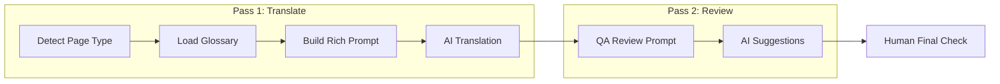

# Translation Workflow Implementation Plan

## Current State

The translation system lives in two files:

- [src/pages/api/translate.ts](src/pages/api/translate.ts) -- API endpoint that sends all translatable content to Claude/OpenAI in a single prompt
- [sanity/actions/translateAction.tsx](sanity/actions/translateAction.tsx) -- Sanity Studio action with provider choice, mode selection, and custom instructions textarea

Currently it does a **single API call** with a generic prompt ("rewrite in natural German") plus whatever custom instructions the editor types. This covers your step 3 loosely, but steps 1-2 and 4-7 are not addressed.

## Architecture Decision: Enriched Single Pass vs Multi-Pass

Running 7 separate API calls per document would be prohibitively expensive and slow across 300+ posts. Instead, the plan uses a **two-pass approach**:

- **Pass 1 (Translation):** A comprehensive prompt that embeds steps 1-6 (content analysis, glossary, translation, localization, conversion, consistency) into a single intelligent call, guided by a glossary document and page-type detection
- **Pass 2 (Review -- optional):** A separate "QA review" pass that checks the translated output against steps 4-7 (localization quality, CTA strength, SEO metadata, consistency)
- **Step 8 (Human):** Final manual review by the editor




## Implementation Details

### 1. Create Translation Glossary File

Create `docs/translation-glossary-de.md` containing:

- **Brand terms** that must NOT be translated (Rapture, Rapturecamps, Green Bowl, Padang Padang, Coxos Surf Villa, etc.)
- **Established surf terms** to keep in English (Lineup, Surfspot, Surfcamp, Reef Break, Beach Break, etc.)
- **Terms to translate** with preferred German equivalents (e.g., "surf lesson" -> "Surfstunde", "booking" -> "Buchung")
- **CTA preferences** (e.g., "Book Now" -> "Jetzt buchen", "Learn More" -> "Mehr erfahren")
- **Words/phrases to avoid** (overly formal language, specific anglicisms)
- **Form of address:** du/ihr (informal), never Sie
- **German SEO keywords** per page type (e.g., "Surfcamp Portugal", "Surfen lernen Bali")
- **Tone guidelines:** casual, inspiring, adventurous, like a friend recommending a trip
- **Few-shot translation examples** — 5-8 real before/after pairs across different content types (headlines, body copy, CTAs, meta descriptions, FAQ answers) that demonstrate the desired tone, sentence structure, and natural German phrasing. LLMs follow concrete examples more reliably than abstract rules, so these serve as the "gold standard" the AI calibrates against

### 2. Enhance the Translation Prompt with Page-Type Awareness

Modify `buildTranslationPrompt()` in [src/pages/api/translate.ts](src/pages/api/translate.ts) to:

- Accept `documentType` parameter (detected from Sanity `_type`: blogPost, camp, country, page, campSurfPage, etc.)
- Load and inject the glossary content into the prompt
- Add page-type-specific instructions:
  - **Landing pages / camp pages:** Focus on conversion, strong CTAs, benefit-driven headlines
  - **Blog posts:** Natural editorial tone, SEO keyword awareness, readable flow
  - **Legal/policy pages:** Formal but clear, legally accurate
  - **FAQ pages:** Conversational, direct answers
- Include localization checklist in the prompt itself (check anglicisms, natural sentence structure, idiomatic expressions)

### 3. Add Optional Review/QA Pass

Add a new API mode and UI flow for reviewing already-translated content.

**API side** -- new `mode: "review"` in [src/pages/api/translate.ts](src/pages/api/translate.ts):

- Fetches the **German target document** (already translated)
- Extracts all translated text fields using the same `extractTranslatableContent()` logic
- Sends them to the AI with a **review-focused prompt** that asks it to check:
  - Awkward anglicisms or unnatural German phrasing
  - Headline/CTA strength (do they sound like native marketing copy?)
  - Terminology consistency across the document
  - SEO metadata quality (meta title, description)
  - Missing or weak benefit statements
- The AI returns a JSON array of suggestions, each containing:

```json
{
  "field": "pageBuilder[2].heading",
  "current": "Entdecke unsere Surf Lessons",
  "suggested": "Entdecke unsere Surfstunden",
  "reason": "Anglicism: 'Surf Lessons' should be 'Surfstunden' in German"
}
```

- Only fields that need improvement are returned (not the whole document)

**UI side** -- displayed in a Sanity Studio dialog:

- Each suggestion shown as a card: current text, suggested text, reason
- Per-suggestion "Accept" button (patches that single field via Sanity client)
- "Apply All" button at the top to accept all suggestions at once
- Accepted suggestions are visually marked with a checkmark
- The dialog stays open so the editor can review incrementally

### 4. Update the Translate Action UI

Modify the "pick-mode" dialog in [sanity/actions/translateAction.tsx](sanity/actions/translateAction.tsx):

**Page type label:**

- Detect `_type` from the document (blogPost, camp, country, campSurfPage, campRoomsPage, campFoodPage, page, homepage)
- Show a small label like "Blog Post" or "Camp Page" at the top of the dialog, purely informational

**Custom instructions area -- replaced with glossary preview + notes:**

- Show the glossary content (from `docs/translation-glossary-de.md`) as a **read-only collapsible preview** so the editor can see what rules the AI will follow
- Below it, a smaller "Additional notes" textarea for one-off overrides (e.g., "This post is about Portugal specifically, emphasize Ericeira")
- The glossary content + any additional notes are both sent to the AI

**Action buttons for German documents:**

1. "Translate new content only" -- existing behavior, now with enriched prompt
2. "Re-translate everything" -- existing behavior, now with enriched prompt
3. "Review translation" -- runs the QA review pass on the German content

The review pass is **German-only**. English pages already have the SEO Check action which covers content quality, headline strength, CTA wording, and metadata. The "Review translation" button only appears when viewing a German document that has translated content.

## What This Does NOT Change

- The core extraction/application logic (`extractTranslatableContent`, `applyTranslations`) stays the same
- Section-by-section translation already happens (content is sent as indexed entries by field path)
- Slug translation logic stays the same
- Provider choice (Claude/OpenAI) stays the same

