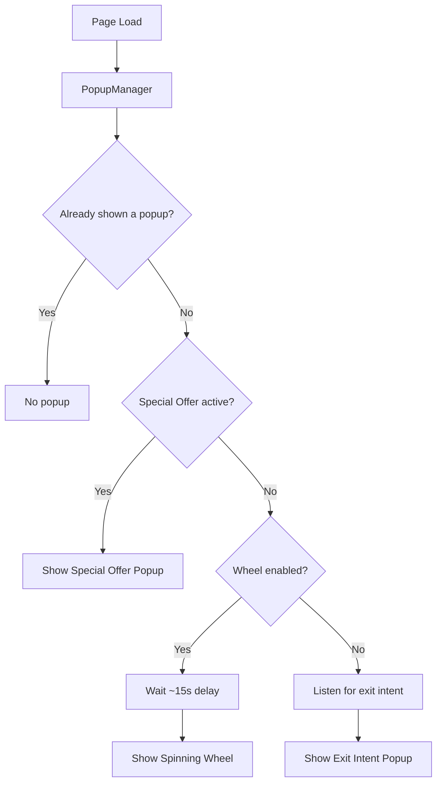

# Website Popup System

## Architecture

A central **PopupManager** (inline script in BaseLayout) coordinates all 3 popup types. It uses `sessionStorage` to track which popup has been shown and enforces the priority rule: **Special Offer > Spinning Wheel > Exit Intent** (only one fires per session).

Each popup is a standalone `.astro` component with its own markup, styles, and inline script, all rendered in [BaseLayout.astro](src/layouts/BaseLayout.astro) alongside the existing `ContactWidget`.

## Components

### 1. Exit Intent Popup
**File:** `src/components/popups/ExitIntentPopup.astro`

- **Trigger:** Mouse leaves viewport top edge (desktop), or 45s timeout as fallback (mobile has no reliable exit intent)
- **Content:** Full-screen overlay with a centered card showing a voucher code, short message ("Wait! Here's 10% off your next surf camp"), a copy-to-clipboard button, and a CTA linking to the booking page
- **Dismiss:** Close button (X), click outside, or Escape key
- **Visual style:** Dark overlay (`bg-black/60`), white card with brand-blue accent, subtle scale-in animation

### 2. Spinning Wheel Popup
**File:** `src/components/popups/SpinningWheelPopup.astro`

- **Trigger:** Timed (show after ~15 seconds on page), only on pages where enabled
- **Flow:** 
  1. Show email input form with headline ("Spin to Win!")
  2. User enters email and clicks "Spin"
  3. Wheel animates (CSS transform rotation, ~4s spin with easing)
  4. Prize is revealed with a congratulations message and voucher code
- **Wheel:** Canvas-free, pure CSS/HTML wheel with 10 configurable segments, each with a label and color. Rotation uses `transform: rotate()` with `transition: transform 4s cubic-bezier(0.17, 0.67, 0.12, 0.99)`
- **10 segments** (hardcoded, example prizes): 5% off, 10% off, Free yoga class, 15% off, Free surf lesson, 5% off, 20% off, Free t-shirt, 10% off, Better luck next time
- **Dismiss:** Close button, Escape key
- **Visual style:** Dark overlay, large centered card with the wheel on top, email form below

### 3. Special Offers Popup
**File:** `src/components/popups/SpecialOfferPopup.astro`

- **Trigger:** Timed (show after ~5 seconds), highest priority
- **Activation:** Controlled via a `data-special-offer` attribute on the page's `<main>` tag, or a prop passed through BaseLayout. Can be set per-page or globally
- **Content:** Headline, offer description, optional image, CTA button, countdown timer (optional, for urgency)
- **Props:** `offerHeadline`, `offerBody`, `offerCta`, `offerCtaHref`, `offerImage` (all passed from the page)
- **Dismiss:** Close button, click outside, Escape key
- **Visual style:** Dark overlay, centered card with gradient accent border

## Integration in BaseLayout

[BaseLayout.astro](src/layouts/BaseLayout.astro) changes:
- Add new optional props: `showWheel?: boolean`, `specialOffer?: { headline: string; body: string; cta: string; ctaHref: string; image?: string }`
- Import and render all 3 popup components (they self-manage visibility)
- Add a small `PopupManager` inline script that:
  - Checks `sessionStorage.getItem("rc_popup_shown")`
  - Determines which popup to activate based on priority and page config
  - Sets `sessionStorage.setItem("rc_popup_shown", "true")` once any popup is triggered
  - Dispatches a custom event (`rc:show-popup`) with the popup type, which each component listens for

## Shared Patterns

- **Overlay:** All 3 share the same full-screen overlay pattern (`fixed inset-0 z-[60] bg-black/60 backdrop-blur-sm`)
- **Body scroll lock:** `document.body.style.overflow = "hidden"` on open, restored on close (same pattern as mobile menu)
- **Animation:** Fade-in overlay + scale-up card using Tailwind transitions
- **Session tracking:** Single `sessionStorage` key ensures only one popup per session
- **Accessibility:** Focus trap within popup, Escape to close, `aria-modal="true"`, `role="dialog"`

## File Summary

- **New files (4):**
  - `src/components/popups/ExitIntentPopup.astro`
  - `src/components/popups/SpinningWheelPopup.astro`
  - `src/components/popups/SpecialOfferPopup.astro`
  - `src/components/popups/PopupOverlay.astro` (shared overlay/close wrapper)
- **Modified files (1):**
  - `src/layouts/BaseLayout.astro` (import popups, add props, add manager script)
