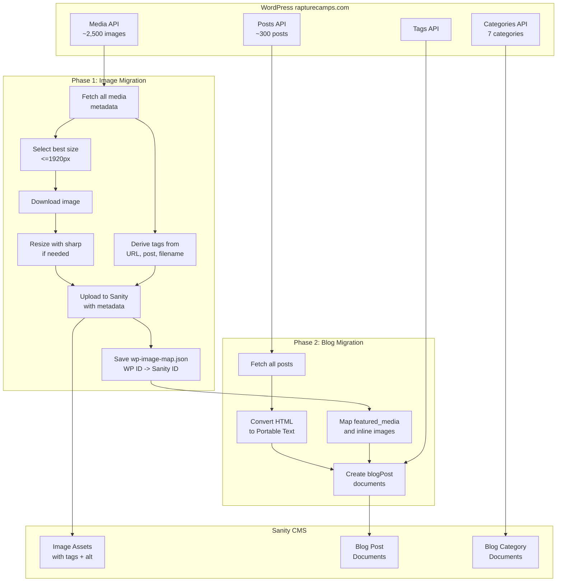

# WordPress Image and Blog Migration Plan

## Context

The WordPress site at rapturecamps.com hosts ~2,500 images in its media library and ~300 blog posts. Images need to be migrated to Sanity first, since blog posts reference them. The WordPress REST API exposes all data needed:

- **Media**: `/wp-json/wp/v2/media` — id, source_url, alt_text, title, caption, mime_type, media_details (with pre-generated sizes), post (parent post ID)
- **Posts**: `/wp-json/wp/v2/posts` — id, title, slug, date, content (HTML), featured_media, categories, tags
- **Categories**: 7 total (Bali, Costa Rica, Inspiration, Morocco, Nicaragua, Portugal, Uncategorized)
- **Tags**: Many SEO-style tags available

Current Sanity has no custom `imageAsset` schema, no media plugin, and a ready `blogPost` schema at [sanity/schemas/blogPost.ts](sanity/schemas/blogPost.ts) with Portable Text body, featured image, categories, and tags.

---

## Phase 1: Image Migration

### 1A. Extend imageAsset schema with custom metadata

Add a custom `sanity.imageAsset` schema extension to store tags on each image. This allows filtering and organizing the 2,500 images inside Sanity Studio without any plugin.

**Fields to add to imageAsset:**
- `tags` — array of strings (e.g., `["bali", "green-bowl", "blog", "surfing"]`)
- `wpMediaId` — number (original WordPress media ID, for deduplication and blog migration mapping)

This is a lightweight schema addition in [sanity/schemas/index.ts](sanity/schemas/index.ts).

### 1B. Build the migration script: `sanity/migrate-wp-images.mjs`

**Step 1 — Fetch all media metadata from WordPress**
- Paginate through `/wp-json/wp/v2/media?per_page=100` (estimated ~25 pages)
- For each item, extract: `id`, `source_url`, `alt_text`, `title.rendered`, `caption.rendered`, `mime_type`, `post` (parent post ID), `media_details.sizes`, `media_details.width`, `media_details.height`
- Store all metadata in memory for processing

**Step 2 — Determine the best image size to download**
- Size selection priority:
  1. If original is <=1920px on longest side -> use original (`source_url`)
  2. If a `1536x1536` WordPress size exists -> use that (pre-generated, no local processing needed)
  3. If original is >1920px and no 1536 size -> download original, resize locally with `sharp` to max 1920px longest side
- This avoids uploading unnecessarily large files while keeping quality high

**Step 3 — Derive tags from available metadata**
- **From URL path**: `/wp-content/uploads/2025/05/bali-green-bowl-surf.jpg` -> extract year, potential camp/country keywords
- **From parent post**: Use the `post` field to look up which blog post the image belongs to, then use that post's categories to determine country (Bali, Portugal, etc.)
- **From filename**: Parse the slug/filename for known camp names and keywords
- **Tag mapping logic**:
  - Match against known camp slugs: `green-bowl`, `padang-padang`, `avellanas`, `banana-village`, `maderas`, `ericeira`, `milfontes`, `coxos`
  - Match against known countries: `bali`, `portugal`, `costa-rica`, `morocco`, `nicaragua`
  - Add `blog` tag if the image is attached to a post
  - Add year tag from upload path (e.g., `2025`)

**Step 4 — Upload to Sanity**
- Use `client.assets.upload('image', buffer, { filename, contentType })` to upload each image
- After upload, patch the asset document to set:
  - `altText` (native Sanity field)
  - `title` (native Sanity field)
  - `description` (from WordPress caption)
  - `tags` (custom field — array of derived tag strings)
  - `wpMediaId` (custom field — WordPress ID for mapping)

**Step 5 — Save mapping file**
- Write `sanity/wp-image-map.json` mapping WordPress media ID to Sanity asset ID:
```json
{
  "17383": {
    "sanityId": "image-abc123-1920x1080-jpg",
    "sourceUrl": "https://www.rapturecamps.com/wp-content/uploads/...",
    "altText": "Bioluminescence In Costa Rica",
    "tags": ["costa-rica", "blog", "2025"]
  }
}
```
- This file is critical for Phase 2 (blog migration)

### 1C. Execution details

- **Rate limiting**: 2-3 concurrent downloads, 1-second pause between Sanity uploads to respect API limits
- **Resume capability**: Check if an image with the same `wpMediaId` already exists in Sanity before uploading (skip duplicates). This allows re-running the script if interrupted
- **Progress logging**: Print progress every 25 images (e.g., `[125/2500] Uploaded bali-green-bowl-surf.jpg (tags: bali, green-bowl, blog)`)
- **Estimated runtime**: 30-60 minutes for all ~2,500 images

### 1D. Dependencies

- `sharp` — for local image resizing when WordPress doesn't have a pre-generated size <=1920px (install via npm)
- `@sanity/client` — already installed

---

## Phase 2: Blog Post Migration (after Phase 1)

This phase runs after all images are in Sanity.

### 2A. Create blog categories in Sanity

- Map the 7 WordPress categories to `blogCategory` documents: Bali, Costa Rica, Inspiration, Morocco, Nicaragua, Portugal (skip Uncategorized)

### 2B. Build the blog migration script: `sanity/migrate-wp-posts.mjs`

- Fetch all ~300 posts from `/wp-json/wp/v2/posts`
- For each post:
  1. **Featured image**: Look up `featured_media` ID in `wp-image-map.json` to get the Sanity asset ID
  2. **Body content**: Convert HTML (`content.rendered`) to Sanity Portable Text:
     - `<p>`, `<h2>`, `<h3>`, `<h4>` -> block nodes
     - `<strong>`, `<em>` -> marks
     - `<a href>` -> link annotations
     - `<blockquote>` -> blockquote style
     - `<ul>/<ol>/<li>` -> list blocks
     - `` -> image blocks, matching `src` URLs to Sanity assets via the mapping
  3. **Categories**: Map WordPress category IDs to Sanity `blogCategory` references
  4. **Tags**: Convert WordPress tag IDs to tag names (fetch from WP tags API), store as string array
  5. **Metadata**: `publishedAt` from `date`, `slug` from `slug`, `excerpt` from first paragraph or WP excerpt
  6. Create `blogPost` document in Sanity

### 2C. HTML to Portable Text conversion

This is the most complex part. Options:
- Use `@sanity/block-tools` with `htmlToBlocks()` — Sanity's official HTML-to-Portable-Text converter
- Custom regex-based parser for simpler structure

Recommend `@sanity/block-tools` for accuracy.

---

## Data flow diagram



---

## What gets stored on each image in Sanity

For every uploaded image, the Sanity asset document will contain:

- **title** — from WordPress `title.rendered`
- **altText** — from WordPress `alt_text`
- **description** — from WordPress `caption.rendered`
- **originalFilename** — descriptive filename (e.g., `bali-green-bowl-surf-lineup.jpg`)
- **tags** (custom) — derived array like `["bali", "green-bowl", "blog", "2025"]`
- **wpMediaId** (custom) — original WordPress ID for mapping

This means when browsing assets in Sanity Studio, you can identify and search for images by camp, country, year, and type.
