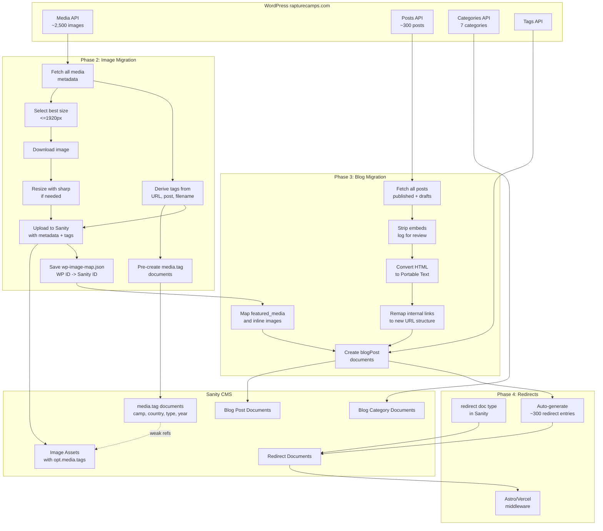

# WordPress Image and Blog Migration

## Context

The WordPress site at rapturecamps.com hosts ~2,500 images in its media library and ~300 blog posts. Images need to be migrated to Sanity first, since blog posts reference them. The WordPress REST API exposes all data needed:

- **Media**: `/wp-json/wp/v2/media` -- id, source_url, alt_text, title, caption, mime_type, media_details (with pre-generated sizes), post (parent post ID)
- **Posts**: `/wp-json/wp/v2/posts` -- id, title, slug, date, content (HTML), featured_media, categories, tags, status (publish/draft)
- **Categories**: 7 total (Bali, Costa Rica, Inspiration, Morocco, Nicaragua, Portugal, Uncategorized)
- **Tags**: Many SEO-style tags available

Current Sanity has a ready `blogPost` schema at [sanity/schemas/blogPost.ts](sanity/schemas/blogPost.ts) with Portable Text body, featured image, categories (references), and tags (strings). An old Storyblok migration script exists at [scripts/migrate-wordpress.ts](scripts/migrate-wordpress.ts) with reusable WP fetch helpers.

---

## Approach: sanity-plugin-media for tagging

Sanity's built-in media library is Enterprise-only. We install `**sanity-plugin-media`** which provides:

- Full media browser in Sanity Studio (standalone tool in top nav + custom asset source for image/file fields)
- Tag management via `media.tag` documents (stored as weak refs in `opt.media.tags[]` on asset documents)
- Faceted filtering by tag, file size, orientation, type
- Batch tagging, editing of alt text / title / description
- Virtualized grid + table views for browsing thousands of assets

No custom `sanity.imageAsset` schema extension is needed. All tagging goes through the plugin's `media.tag` system.

---

## Phase 1: Setup

### 1a. Install dependencies

```bash
npm install --save sanity-plugin-media sharp node-html-parser
```

### 1b. Configure the plugin in [sanity.config.ts](sanity.config.ts)

```typescript
import { media } from 'sanity-plugin-media'

// Add to plugins array (before structureTool):
plugins: [
  media(),
  structureTool({ ... }),
  documentInternationalization({ ... }),
  visionTool(),
]
```

Also hide the `media.tag` document type from the sidebar (the plugin manages tags internally via its own UI). Filter it out in the `structureTool` structure definition.

---

## Phase 2: Image Migration (~2,500 images)

### Migration script: `sanity/migrate-wp-images.mjs`

Both migration scripts support a `**--dry-run**` flag. When set, the script fetches all data, derives tags, logs what it would create (counts, sample entries), but writes nothing to Sanity. This lets you preview and verify before committing.

#### Step 1 -- Fetch all WordPress media metadata

- Paginate through `https://www.rapturecamps.com/wp-json/wp/v2/media?per_page=100&page=N` (~25 pages)
- Per image, collect: `id`, `source_url`, `alt_text`, `title.rendered`, `caption.rendered`, `description.rendered`, `media_details.width/height/sizes`, `post` (parent post ID), `mime_type`

#### Step 2 -- Fetch WordPress posts/categories for tag derivation

- Fetch all posts and categories to build lookups
- Build mapping: WP media ID -> which posts reference it -> derive camp, country, content type
- Reuse paginated fetch pattern from [scripts/migrate-wordpress.ts](scripts/migrate-wordpress.ts) lines 60-86

#### Step 3 -- Pre-create `media.tag` documents in Sanity

Create `media.tag` documents upfront. The plugin stores tags with a `name` field of type `slug`. Examples:

- **Camp tags**: `camp:bali`, `camp:sri-lanka-ahangama`, `camp:morocco`, `camp:ericeira`, etc.
- **Country tags**: `country:indonesia`, `country:sri-lanka`, `country:morocco`, `country:portugal`, etc.
- **Content type tags**: `type:blog`, `type:featured-image`, `type:gallery`
- **Year tags**: `year:2023`, `year:2024`, `year:2025`

The script collects all needed tags from the WP data, creates them in bulk, and stores a `{ tagSlug: tagDocId }` lookup for use during upload.

#### Step 4 -- Derive tags per image

Tag derivation logic:

- **From parent post categories**: Use the `post` field to look up which blog post the image belongs to, then that post's WP categories to determine country (Bali, Portugal, etc.)
- **From URL path**: `/wp-content/uploads/2025/05/bali-green-bowl-surf.jpg` -> extract year, camp/country keywords
- **From filename**: Parse slug for known camp names (`green-bowl`, `padang-padang`, `avellanas`, `banana-village`, `maderas`, `ericeira`, `milfontes`, `coxos`)
- **From usage context**: `type:featured-image` if used as `featured_media`, `type:blog` if attached to a post, `type:gallery` for other media

#### Step 5 -- Download, resize, upload each image

For each WordPress image:

1. **Select best size to download**:
  - If original is <=1920px on longest side -> use `source_url` directly
  - If a `1536x1536` WP pre-generated size exists -> use that (no local resize needed)
  - Otherwise -> download original, resize locally with `sharp` to max 1920px longest side, preserving aspect ratio and format (JPEG/PNG/WebP)
2. **Upload** to Sanity via `sanityClient.assets.upload('image', buffer, { filename, contentType })`
3. **Set native metadata** on the asset document:
  - `title` from WP `title.rendered`
  - `altText` from WP `alt_text`
  - `description` from WP `caption.rendered` or `description.rendered`
4. **Tag the asset** by patching `opt.media.tags` with weak references to the pre-created `media.tag` documents:

```javascript
   sanityClient.patch(assetId).set({
     'opt.media.tags': [
       { _type: 'reference', _weak: true, _ref: tagDocId, _key: uniqueKey },
     ]
   }).commit()
   

```

1. **Save mapping** to `sanity/wp-image-map.json`:

```json
   {
     "17383": {
       "sanityId": "image-abc123-1920x1080-jpg",
       "sourceUrl": "https://www.rapturecamps.com/wp-content/uploads/...",
       "altText": "Bioluminescence In Costa Rica",
       "tags": ["country:costa-rica", "type:blog", "year:2025"]
     }
   }
   

```

   This file is critical for Phase 3 (blog migration image remapping).

1. **Write to size report** `sanity/image-size-report.csv` with one row per image:
  - `filename`, `wpMediaId`, `originalWidth`, `originalHeight`, `originalSizeKB` (from WP API if available), `uploadedWidth`, `uploadedHeight`, `uploadedSizeKB`, `wasResized` (yes/no), `tags`
  - Sorted by `uploadedSizeKB` descending so the largest images appear at the top
  - Open in any spreadsheet app to filter/sort and identify images worth replacing with smaller versions

#### Resilience

- Process in batches of 10 (parallel downloads/uploads)
- Save progress to a JSON checkpoint file; resume from last successful batch on re-run
- Check if image with same filename already exists in Sanity before uploading (skip duplicates)
- Log skipped/failed items to `sanity/migration-errors.log`
- Rate-limit Sanity API calls (200ms between patches)
- Progress logging every 25 images (e.g., `[125/2500] Uploaded bali-green-bowl-surf.jpg`)
- Estimated runtime: 30-60 minutes

#### Note on Sanity image delivery

Sanity optimizes images automatically on delivery via their CDN -- serving WebP/AVIF, on-the-fly resizing via URL parameters, and quality adjustment. So even large stored images are served efficiently to visitors. The size report is for identifying outliers worth replacing at the source level to reduce storage and keep things clean.

---

## Phase 3: Blog Post Migration (~300 posts)

### Prerequisites

- Phase 2 complete (`sanity/wp-image-map.json` exists with all image mappings)

### Migration script: `sanity/migrate-wp-posts.mjs`

Also supports `**--dry-run`** for preview without writes.

#### Step 1 -- Create blog categories in Sanity

- Fetch WP categories via `/wp-json/wp/v2/categories`
- Create `blogCategory` documents with `name`, `slug`, `description` (skip "Uncategorized")
- Build mapping: `{ [wpCategoryId]: sanityCategoryId }`

#### Step 2 -- Fetch all WordPress posts (published AND drafts)

- Paginate through `/wp-json/wp/v2/posts?per_page=100&page=N&status=any` (requires auth) or fetch published + draft separately
- Per post: `title`, `slug`, `content.rendered` (HTML), `excerpt`, `date`, `status`, `featured_media`, `categories`, `tags`, Yoast SEO data (`yoast_head_json`)
- **Draft handling**: WP posts with `status: "draft"` will be created in Sanity as draft documents (using `_id` prefix `drafts.`) so they don't appear on the live site but are available for editing in Studio

#### Step 3 -- Convert HTML to Portable Text

For each post's `content.rendered`, parse with `node-html-parser` and convert:

- `<p>` -> block (style: "normal")
- `<h2>`, `<h3>`, `<h4>` -> block (style: "h2"/"h3"/"h4")
- `<blockquote>` -> block (style: "blockquote")
- `<strong>`, `<em>` -> marks (decorators)
- `<a href>` -> mark annotation (link) **with internal URL remapping** (see below)
- `` -> image block, remapping `src` URL to Sanity asset reference via `wp-image-map.json`
- `<ul>/<ol>/<li>` -> list blocks

**Internal link remapping**: During conversion, detect any `<a href>` pointing to `rapturecamps.com` (or relative paths) and rewrite the URL to the new site structure. Build a slug lookup from all fetched posts, then:

- `https://www.rapturecamps.com/bioluminescence-in-costa-rica/` -> `/blog/bioluminescence-in-costa-rica`
- `https://www.rapturecamps.com/surfcamp/bali/` -> `/surfcamp/bali` (preserve non-blog internal links as relative paths)
- External links (other domains) -> keep as-is
- Log any internal links that can't be matched for manual review

**Embedded content handling**: WordPress posts may contain embeds (YouTube iframes, Instagram embeds, tweet embeds, etc.). These will be **stripped** from the Portable Text output and logged to `sanity/stripped-embeds.log` with the post slug and embed HTML, so they can be manually re-added in Sanity Studio if needed.

#### Step 4 -- Create blog post documents

For each post, create a `blogPost` document:

- `title`, `slug`, `excerpt`, `publishedAt` from WP data
- `body` = converted Portable Text
- `featuredImage` = Sanity asset reference (looked up from `wp-image-map.json` via `featured_media` ID)
- `categories` = array of references to Sanity `blogCategory` docs
- `tags` = array of WP tag names (string array, matching current schema)
- `seo` = `{ title, description }` from Yoast data
- `language` = "en"
- Draft posts: created with `_id: "drafts.blogPost-{slug}"` so they appear as unpublished in Studio

#### Step 5 -- Verify and report

- Log: total created (published vs. draft), skipped, errors
- List any posts with unconverted HTML elements for manual review
- List any stripped embeds for manual re-adding

---

## Phase 4: Redirect Management

### Problem

WordPress blog posts live at `rapturecamps.com/post-slug/` but the new site uses `/blog/post-slug`. Search engines need 301 redirects to preserve rankings. Beyond the migration, a general redirect management tool in Sanity is useful long-term.

### 4a. Create `redirect` schema in Sanity

New document type: `redirect`

- `fromPath` (string, required) -- e.g., `/bioluminescence-in-costa-rica/`
- `toPath` (string, required) -- e.g., `/blog/bioluminescence-in-costa-rica`
- `statusCode` (number, default 301) -- 301 (permanent) or 302 (temporary)
- `isActive` (boolean, default true) -- toggle redirects on/off without deleting
- `note` (string, optional) -- e.g., "WP migration" or "Page renamed"

Add to Sanity Studio sidebar under **Site Settings** or as its own section.

### 4b. Wire up Astro/Vercel middleware

Create an Astro middleware (`src/middleware.ts`) or Vercel edge middleware that:

1. On each request, checks if the path matches a redirect `fromPath`
2. If matched and active, returns a 301/302 response to `toPath`
3. Redirects are fetched from Sanity at build time and cached (or fetched at edge with short TTL for real-time updates)

For best performance, generate a static redirect map at build time via a Sanity query and embed it in Vercel config or Astro middleware.

### 4c. Auto-generate redirect entries from migration

After blog migration, run a script that creates `redirect` documents for every migrated post:

- `fromPath`: `/{wp-slug}/` (old WordPress URL)
- `toPath`: `/blog/{wp-slug}` (new site URL)
- `statusCode`: 301
- `note`: "WordPress migration"

This gives you ~300 redirects covering all blog posts. You can also manually add more redirects in Studio for any other URL changes.

---

## Data Flow




---

## File Changes Summary

- `package.json` -- Add `sanity-plugin-media`, `sharp`, `node-html-parser`
- [sanity.config.ts](sanity.config.ts) -- Add `media()` plugin, hide `media.tag` from sidebar, add `redirect` to structure
- `sanity/schemas/redirect.ts` -- NEW: redirect document schema
- `sanity/schemas/index.ts` -- Add redirect to exports
- `src/middleware.ts` -- NEW: redirect middleware reading from Sanity
- `sanity/migrate-wp-images.mjs` -- NEW: image migration script (with --dry-run)
- `sanity/migrate-wp-posts.mjs` -- NEW: blog post migration script (with --dry-run)
- `sanity/wp-image-map.json` -- NEW: generated WP-to-Sanity image mapping (gitignored)
- `sanity/image-size-report.csv` -- NEW: generated CSV of all migrated images sorted by size (gitignored)
- `sanity/stripped-embeds.log` -- NEW: generated log of stripped embeds (gitignored)

---

## What gets stored on each image in Sanity

For every uploaded image, the Sanity asset document will contain:

- **title** -- from WordPress `title.rendered`
- **altText** -- from WordPress `alt_text`
- **description** -- from WordPress `caption.rendered`
- **originalFilename** -- descriptive filename (e.g., `bali-green-bowl-surf-lineup.jpg`)
- **opt.media.tags** -- array of weak references to `media.tag` documents (e.g., `camp:bali`, `country:indonesia`, `type:blog`, `year:2025`)

After migration, all images are browsable in Sanity Studio under the **Media** tool in the top nav, filterable by any combination of tags, with full editing of metadata.